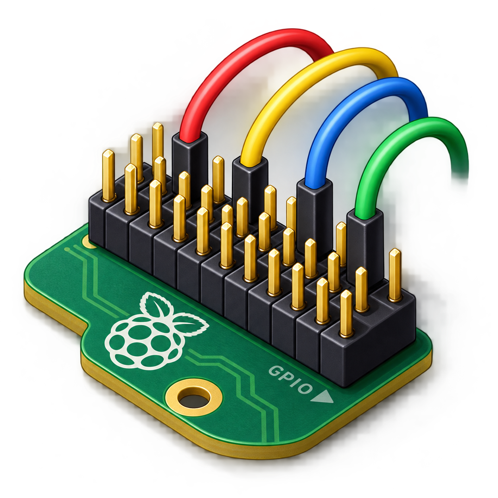

# AirPins

A GPIO tool for the Raspberry Pi on **air/OS** and Haiku: set the pins of the
40-pin header as inputs or outputs, switch outputs, and watch the level of
every configured pin as an LED and a waveform. Configurations are saved as
`.pigg` files.



## Based on pigg

**AirPins is a native Haiku version of [pigg](https://github.com/andrewdavidmackenzie/pigg)**,
the Raspberry Pi GPIO GUI and CLI by **Andrew Mackenzie and the pigg
contributors**, licensed under the Apache License 2.0
(a copy is in [`third_party/pigg/LICENSE`](third_party/pigg/LICENSE)).

AirPins is written from scratch in C++ with Haiku's Interface Kit. It contains
no code from pigg, but its design comes from pigg:

- the three layouts: *Board pin layout* (the pins as on the header, two
  mirrored columns), *BCM pin layout* (GPIO number order) and *Compact layout*
  (only configured pins, the others in a dock);
- the pins drawn as coloured discs with their board numbers, and pigg's colours
  (3V3 yellow, 5V red, ground black, I2C light blue, SPI violet, UART green,
  other GPIOs orange);
- the menu on each pin: *Input* with *Pull up*, *Pull down* or *No pull*,
  *Output*, *Unused*; inputs default to the pull they have after reset;
- the LED of each configured pin (green high, red low, grey unknown), the
  output's LED as a "clicker" that inverts the output while it is held down,
  and the waveform of each pin's recent levels (16 seconds, as in pigg);
- the toggle that sets an output's level;
- the configuration files: AirPins reads and writes pigg's `.pigg` JSON
  format, `{"pin_functions":{"17":{"Output":true},"26":{"Input":"PullUp"}}}`,
  so the two programs open each other's files;
- which pins are offered: GPIO 2 to 27; GPIO 0 and 1 (the HAT ID EEPROM's
  bus) are left alone;
- the device details (model, revision, serial number), the "Unsaved changes"
  note and the question before unsaved changes are lost;
- simulated pins on a machine without GPIO hardware, like pigg's
  "fake hardware": inputs change at random.

Thank you to Andrew Mackenzie and everyone who works on pigg.

What pigg has and AirPins does not: the remote side — `pigglet` (a GPIO
agent on another Pi, over TCP or iroh-net), `porky` (Pi Pico firmware over
USB or Wi-Fi), mDNS discovery and the Pico's Wi-Fi setup. AirPins works with
the pins of the machine it runs on.

What AirPins adds: it shows what a pin is doing before you touch it (for
example GPIO 14 and 15 are UART0, the system's serial console, on air/OS) and
asks before it takes such a pin over; a configured pin gets its old function
back when it is set to *Unused* or AirPins quits (the driver guarantees it,
even if AirPins crashes); the waveform's time span can be changed; level
changes are timestamped by the kernel driver in the GPIO interrupt.

## Requirements

- The **air/OS Raspberry Pi 4 image**, whose `rpi_gpio` driver
  (`/dev/misc/rpi_gpio`) gives programs the header's pins. Raspberry Pi 4
  Model B and 400 (BCM2711).
- Anywhere else (another computer, QEMU, a Pi without the driver) AirPins
  starts with simulated pins and says so in its status bar.
  `AirPins --simulate` asks for them on a Pi as well, and *Device ▸ Use
  simulated pins* switches at any time.

## Using AirPins

AirPins is in the Deskbar's *Applications* menu.

- **Configure a pin**: click its disc, or use the menu next to its name.
  *Input* turns on the pin's default pull resistor; change it with the second
  menu. *Output* starts low.
- **Outputs**: the *High*/*Low* button sets the level. Hold the mouse button
  on the output's LED to invert the level for as long as you hold it.
- **Inputs**: the LED shows the level; the waveform shows the last 16 seconds
  (*View ▸ Waveform time span*: 4, 16, 30 or 60 seconds). Point at a waveform
  to read the level at that moment and the number of changes.
- **Layouts**: the toolbar's three layout buttons or *View* (Alt+1, Alt+2,
  Alt+3).
- **Files**: *File ▸ Open configuration* (Alt+O), *Save configuration*
  (Alt+S), *Save configuration as* (Shift+Alt+S). Double-clicking a `.pigg`
  file opens it in AirPins; `AirPins file.pigg` does the same from Terminal.
  Pins a file names that the header does not offer are left out.
- **Set all pins to Unused**: the toolbar's reset button or the *File* menu.
- **Device details**: the chip button, *Device ▸ Device details* (Alt+I).
- Hover over a pin's disc for its alternate functions (ALT0 to ALT5) and what
  it is doing now.

When AirPins quits, every pin it configured gets back the function, pull and
level it had before, as pigg's pins do when it exits. A pin that another
program holds is shown as *in use* and cannot be changed.

**Take care with the hardware**: the pins are 3.3 V and not 5 V tolerant; an
output connected straight to ground, 3.3 V or another output can be damaged.
GPIO 14 and 15 carry the serial console; taking them over silences it until
they are set back to *Unused*.

## Building

On air/OS or Haiku, with the `haiku_devel` package:

```sh
make -j4            # build-haiku/AirPins
make check          # the configuration, board and pin table tests
make package        # artifacts/airpins-1.0.0-1-<arch>.hpkg
```

Cross-building for the Raspberry Pi 4 from the air/OS build machine:

```sh
tools/build-cross.sh            # build-arm64/AirPins
make check-host                 # the same tests on Linux, with sanitizers
tools/deploy-pi.sh <address>    # lab: copy to the board and start it
tools/check-abi.sh              # src/hw/rpi_gpio.h matches the driver's header
```

The image's package is made by `tools/airos/build-arm64-app-packages.sh`
in the air/OS Haiku tree (`build_airpins`).

`make icons` regenerates `src/ui/IconData.h` and
`resources/airpins-icon.hvif`; it needs Python with fontTools and Pillow.

## How it works

| Part | Files |
| --- | --- |
| Pin table (header layout, colours, alternate functions) | `src/model/PinTable.*` |
| `.pigg` files (a small JSON reader) | `src/model/Config.*`, `src/model/Json.*` |
| Raspberry Pi revision codes | `src/model/BoardInfo.*` |
| A pin's level history | `src/model/PinHistory.*` |
| The pins: driver or simulation | `src/hw/LocalGpio.cpp`, `src/hw/SimulatedGpio.cpp`, `src/hw/Gpio.h` |
| Level changes from a thread of their own | `src/hw/EventPump.*` |
| Window, layouts, pin widgets | `src/ui/` |

The driver (`src/add-ons/kernel/drivers/misc/rpi_gpio.cpp` in the air/OS
tree, interface in `src/hw/rpi_gpio.h`) lets a file descriptor claim a header
pin as an input or output and restores the pin when it is released or the
descriptor closes. Edges of claimed inputs are timestamped in the GPIO
interrupt; a pulse shorter than the interrupt's latency shows up as two
changes at the same time; inputs that change faster than about 40 000 times a
second are sampled every 50 ms instead of reported edge by edge.

## Artwork

The application icon is a vector (HVIF) drawing made with
`tools/make-icon.py` after the AirPins artwork in
`resources/branding/AirPins.png`; air/OS has no PNG translator on arm64, and
vector icons stay sharp at every size. The toolbar icons are
[Font Awesome Free](https://fontawesome.com) 6.7.2 by Fonticons, Inc., under
CC BY 4.0 (see [`resources/icons/README.md`](resources/icons/README.md)).

## License

AirPins is distributed under the MIT License (see `LICENSE`).
Copyright 2026 air/OS contributors.
pigg is Copyright Andrew Mackenzie and the pigg contributors, Apache License
2.0. Font Awesome Free icons: CC BY 4.0.
